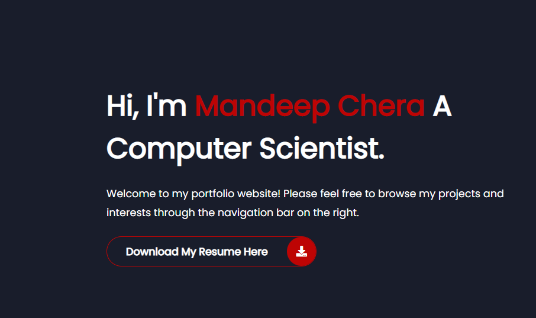
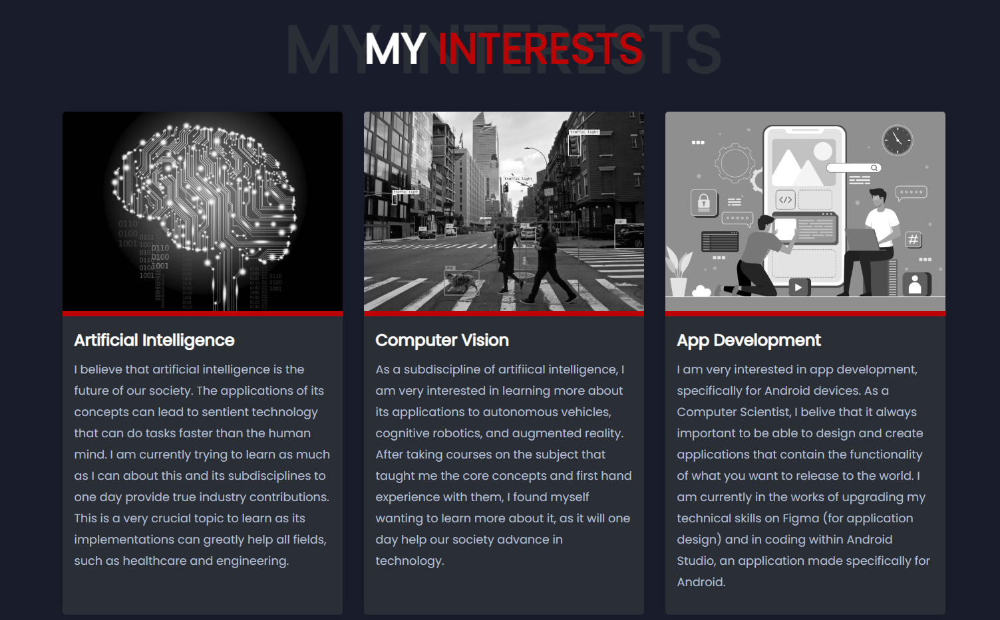
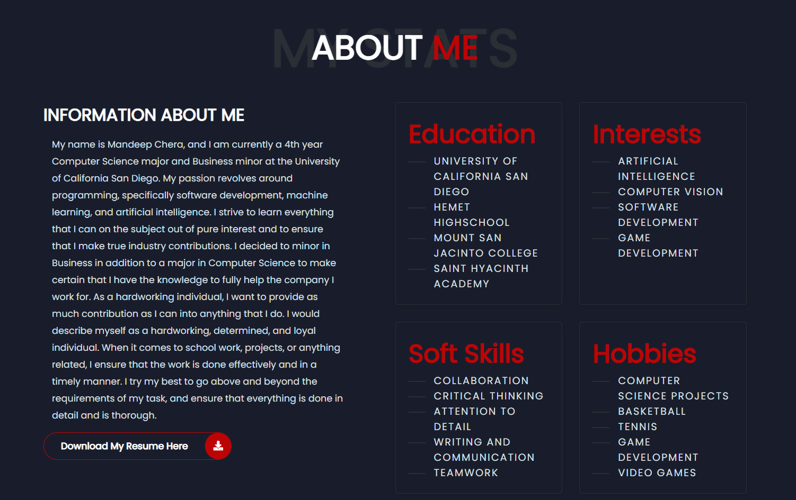
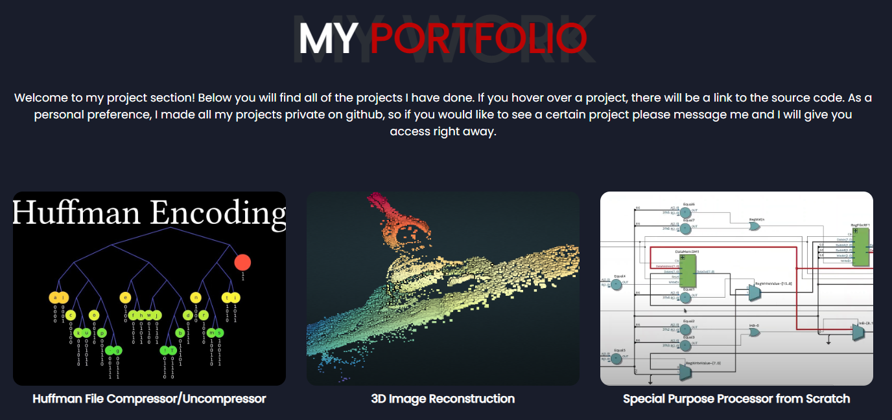
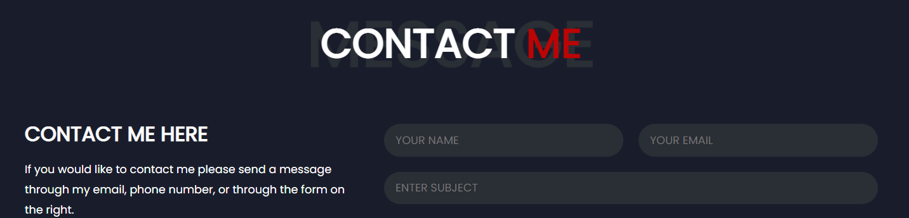

# Portfolio Website

This is my portfolio website that depicts my work experience, projects, and research interests. The website also allows you to contact me and download my resume.
This website was created using HTML/CSS with a small amount of Javascript.

# References
Adrian Hajdin (https://www.youtube.com/c/JavaScriptMastery)
